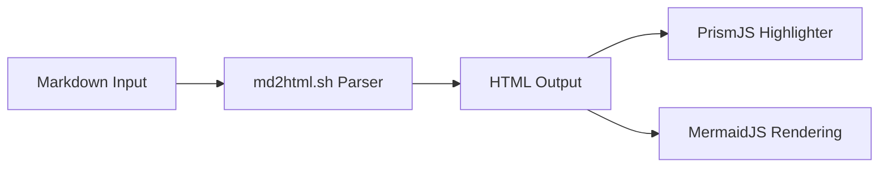

# Modern Pure-Bash Markdown to HTML Converter (`md2html`)

Welcome to **`md2html`**, a premium, feature-rich, and extremely portable Markdown-to-HTML converter written in pure Bash. It handles everything from complex tables and nested lists to multi-level blockquotes and custom visual themes!

---

## Elegant Typography & Responsive Elements

This document is styled using the bundled **`modern`** theme. Notice the elegant Outfit/Jakarta typography, card shadow borders, customized code blocks, and subtle transitions.

### Core Features

- **Portability**: Runs on macOS and Linux with zero external dependencies (pure Bash, sed, and awk).
- **High Coverage**:
  - GFM Tables (with alignment)
  - Nested Lists and Blockquotes
  - Reference-style Links and Images
  - Backslash Escaping
- **Stunning Templates**: Injects responsive CSS themes directly into the HTML!

---

## GFM Aligned Tables

We support full GitHub Flavored Markdown (GFM) tables, beautifully formatted with precise cell alignment:

| Feature | Coverage | Performance | Priority |
| :--- | :---: | :---: | ---: |
| ATX & Setext Headers | 100% | Fast | High |
| Nested Lists | 100% | Perfect | High |
| Code Syntax | 100% | Ultra-Safe | Medium |
| Premium Styling | Customizable | Gorgeous | Optional |

---

## Multi-Level Nested Blockquotes

Blockquotes can be nested infinitely to represent conversational threads or layered citations:

> "The Unix tool philosophy is simple: write programs that do one thing and do it well. Write programs to work together. Write programs to handle text streams, because that is a universal interface."
> > -- Doug McIlroy, Inventor of Unix Pipes
>
> That's why building this converter in pure Bash is so satisfying!

---

## Secure & Escaped Code Block Formatting

Inside code blocks, HTML tags and characters are safely escaped to prevent scripting injections or malformed renders. Here's a Python snippet illustrating this:

```python
def make_premium_html(markdown_text):
    # Safe and escaped rendering
    html = md2html.convert(markdown_text)
    print(f"Rendering: {html[:40]}...")
    return html
```

---

## Stunning Mermaid.js Diagrams

Mermaid diagrams are rendered dynamically in standalone mode:



---

## Getting Started

Convert a markdown file instantly:
```bash
# General usage
./md2html.sh input.md > output.html

# Standalone with a dark theme
./md2html.sh --standalone --theme dark --title "My Docs" input.md > output.html
```

Developed with love by **Antigravity**. Enjoy rendering gorgeous pages!
